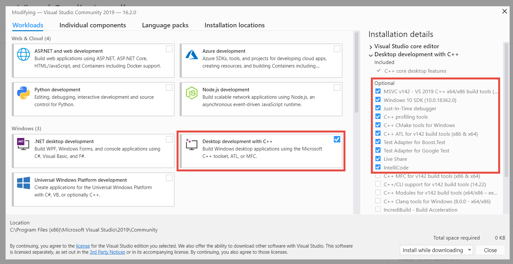

# Welcome to Game
This repository contains Bash and Powershell scripts to generate CMake projects that include SFML library.

##  Requirements
####   **Linux - Ubuntu 18.04**
Please ensure that following required components have been installed:
* CMake
* GNU C++/G++
* GDB
* Git
* CLion
####  **MacOS - Mojave 10.14**
Please ensure that following required components have been installed:
* CLang
* Homebrew
* Git
* CLion
####  **Windows 10**
Please ensure that following required components have been installed:
* Visual Studio Community
* Git
* CLion
##  Installation

####   **Linux - Ubuntu 18.04**
1. Ensure CMake has been installed or install as follow: `` sudo apt install cmake  ``[ENTER]
2. Ensure GNU C++/G++ has been installed or install as follow: `` sudo apt install g++ ``[ENTER]
3. Ensure GNU Debug has been installed or install as follow: `` sudo apt install gdb ``[ENTER]
4. Ensure Git has been installed or install as follow: `` sudo apt install git ``[ENTER]
5. Install CLion see more details in Linux - Ubuntu section: [JetBrains](https://www.jetbrains.com/help/clion/installation-guide.html)
6. Install SFML
    * Open a Terminal: [Ctrl] + [Alt] + [T]
    * Go to Home folder: `` cd ~ ``[ENTER]
    * Verify if folder CLionProjects exists `` ls ``[ENTER] otherwise create that new folder: `` mkdir CLionProjects ``[ENTER]
    * Go to CLionProjects folder: `` cd CLionProjects ``[ENTER]
    * Download game project: `` git clone https://github.com/rrivas-utec/game.git ``[ENTER], and finally
    * Execute the following statements:
      ```
      cd ~/CLionProjects/game/installers/linux
      ./install_sfml.sh
      ``` 
####  **MacOS - Mojave 10.14**
1. Ensure CLang has been installed or if it is necessary run the following statement: `` xcode-select --install ``[ENTER]
2. Ensure Homebrew has been installed or see: [Homebrew](https://brew.sh)
3. Ensure Git has been installed or if it is necessary run the following statement: `` brew install git ``[ENTER]
4. Install CLion see more details in MacOS section: [JetBrains](https://www.jetbrains.com/help/clion/installation-guide.html)
5. Install SFML:
    * Open a Terminal: [Command] + [Spacebar] and write in `` terminal  ``[ENTER]
    * Go to Home folder: `` cd ~ ``[ENTER]
    * Verify if folder CLionProjects exists `` ls ``[ENTER] otherwise create that new folder: `` mkdir CLionProjects ``[ENTER]
    * Go to CLionProjects folder: `` cd CLionProjects ``[ENTER] 
    * Download game project: `` git clone https://github.com/rrivas-utec/game.git ``[ENTER], and finally
    * Execute the following statements:
      ```
      cd ~/CLionProjects/game/installers/macOS
      ./install_sfml.sh
      ``` 
####  **Windows 10**
1. Visual Studio Community 2019: [VS Community](https://visualstudio.microsoft.com/vs/community/)  
   **Minimum Requirement**:   
   > 
2. Git 2.20 or greater: [Git](https://git-scm.com/downloads)
3. Install CLion see more details in CLion 2019 - Visual Studio section: [JetBrains](https://www.jetbrains.com/help/clion/installation-guide.html)
4. Install SFML:
    * Open Powershell:  + R and write in `` powershell ``[ENTER]
    * Go to Home folder: `` cd ~  ``[ENTER]
    * Verify if CLionProjects folder exists `` ls ``[ENTER] otherwise create the new folder: `` mkdir CLionProjects ``[ENTER]
    * Go to CLionProjects folder: `` cd CLionProjects ``[ENTER]
    * Download game project: `` git clone https://github.com/rrivas-utec/game.git ``[ENTER], and finally
    * Execute the following statements:
      ```
      cd ~/CLionProjects/game/installers/windows
      Set-ExecutionPolicy -ExecutionPolicy Unrestricted -Scope Process
      Y
      ./install_sfml.ps1
      ```
##  How to generate a new SFML CMake project?
1. Execute follow statements
   ``` 
   cd ~
   /CLionProjects/game/generators/linux
   ```
2. Define the name of your project, for example **pacman** and execute the following statement:
   ```
   ./gen_project.sh pacman
   ```
   This statement will be generate a new folder at same level of game folder, in this case inside of CLionProjects and it will contain the following files:
   
   
