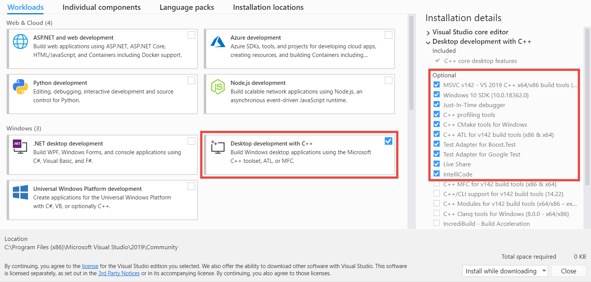
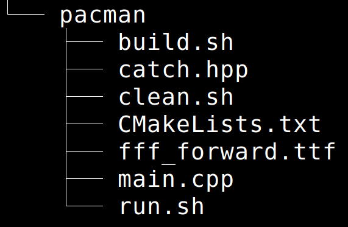

Checkear-<svg><use href="./media/font_awesome/check-square-regular.svg"></use></svg>-ccc 

# Welcome to Game
This repository contains Bash and Powershell scripts to generate CMake projects that include SFML library.

## Table of Content
1. [Requirements](#requirement)  
   - [Linux - Ubuntu](#requirement-ubuntu)  
   - [macOS](#requirement-macOS)  
   - [Windows](#requirement-windows)  
2. [Installation](#installation)  
   - [Linux - Ubuntu](#installation-ubuntu)  
   - [macOS](#installation-macOS)  
   - [Windows](#installation-windows)  
3. [How to generate a new SFML CMake project?](#project)  
   - [Linux - Ubuntu](#project-ubuntu)  
   - [macOS](#project-macOS)  
   - [Windows](#project-windows)  

##  Requirements <a name="requirement"/>
####   **Linux - Ubuntu 18.04** <a name="requirement-ubuntu"/>
Please ensure that following required components have been installed:
* CMake
* GNU C++/G++
* GDB
* Git
* CLion
####  **MacOS - Mojave 10.14** <a name="requirement-macOS"/>
Please ensure that following required components have been installed:
* CLang
* Homebrew
* Git
* CLion
####  **Windows 10** <a name="requirement-windows"/>
Please ensure that following required components have been installed:
* Visual Studio Community
* Git
* CLion
##  Installation <a name="installation"/>

####   **Linux - Ubuntu 18.04** <a name="installation-ubuntu"/>
1. Open a terminal: [Ctrl] + [Alt] + [T]
2. Ensure CMake has been installed: ``cmake --version`` or install as follow: `` sudo apt install cmake  ``
3. Ensure GNU C++/G++ has been installed: ``g++ --version`` or install as follow: `` sudo apt install g++ ``
4. Ensure GNU Debug has been installed: ``gdb --version`` or install as follow: `` sudo apt install gdb ``
5. Ensure Git has been installed: ``git --version`` or install as follow: `` sudo apt install git ``
6. Install CLion see more details in Linux - Ubuntu section: [JetBrains](https://www.jetbrains.com/help/clion/installation-guide.html)
7. Install SFML
    * In the terminal go to Home folder: `` cd ~ ``
    * Verify if folder CLionProjects exists: `` ls `` otherwise create that new folder: `` mkdir CLionProjects ``
    * Go to CLionProjects folder: `` cd CLionProjects ``
    * Download game project: `` git clone https://github.com/rrivas-utec/game.git ``, and finally
    * Execute the following statements:
      ```
      cd ~/CLionProjects/game/installers/linux
      ./install_sfml.sh
      ``` 
####  **MacOS - Mojave 10.14** <a name="installation-macOS"/>
1. Open a terminal: [Command] + [Spacebar] and write in: ``terminal``
2. Ensure CLang has been installed: ``clang --version`` or if it is necessary run follow statement: ``xcode-select --install``
3. Ensure Homebrew has been installed: ``brew --version`` or see: [Homebrew](https://brew.sh)
4. Ensure Git has been installed: ``git --version`` or if it is necessary run the following statement: ``brew install git``
5. Install CLion see more details in MacOS section: [JetBrains](https://www.jetbrains.com/help/clion/installation-guide.html)
6. Install SFML:
    * In the terminal go to Home folder: ``cd ~``
    * Verify if folder CLionProjects exists: ``ls`` otherwise create that new folder: ``mkdir CLionProjects``
    * Go to CLionProjects folder: `` cd CLionProjects`` 
    * Download game project: `` git clone https://github.com/rrivas-utec/game.git``, and finally
    * Execute the following statements:
      ```
      cd ~/CLionProjects/game/installers/macOS
      ./install_sfml.sh
      ``` 
####  **Windows 10** <a name="installation-windows"/>
1. Visual Studio Community 2019: [VS Community](https://visualstudio.microsoft.com/vs/community/)  
   **Minimum Requirement**:  
   
2. Open a powershell terminal: [] + [R] and write in: ``powershell``
3. Install Git 2.20 or greater: [Git](https://git-scm.com/downloads)
4. Install CLion see more details in CLion 2019 - Visual Studio section: [JetBrains](https://www.jetbrains.com/help/clion/installation-guide.html)
5. Install SFML:
    * In the powershell terminal go to Home folder: ``cd ~``
    * Verify if CLionProjects folder exists: ``ls`` otherwise create the new folder: ``mkdir CLionProjects``
    * Go to CLionProjects folder: ``cd CLionProjects``
    * Download game project: ``git clone https://github.com/rrivas-utec/game.git``, and finally
    * Execute the following statements:
      ```
      cd ~/CLionProjects/game/installers/windows
      Set-ExecutionPolicy -ExecutionPolicy Unrestricted -Scope Process
      Y
      ./install_sfml.ps1
      ```
##  How to generate a new SFML CMake project? <a name="project"/>
####   **Linux - Ubuntu 18.04** <a name="project-ubuntu"/>
1. Open a terminal: [Ctrl] + [Alt] + [T]
2. Execute the following statement:
   ``` 
   cd ~/CLionProjects/game/generators/linux
   ```
3. Define the name of your project, for example **pacman** and execute the following statement:<a name="project-ubuntu-step3"/>
   ```
   ./gen_project.sh pacman
   ```
   This statement will generate a new folder called **pacman** at same level of **game** folder, in this case both folders will be inside of **CLionProjects** folder and **pacman** folder will contain the following files:  
     
   The project could be used by CLion IDE but also can be compiled in command line, in order to help command line programming, it contains 3 additional scripts:
   * ``build.sh``, to build a folder called **build** where CMake work stuff is saved.
   * ``run.sh``, to compile the program and generate the executalbe, it verifies if **build** folder is available and if it is not build it.
   * ``clean.sh``, to clean any previous compilation.
####  **MacOS - Mojave 10.14** <a name="project-macOS"/>
1. Open a terminal: [Command] + [Spacebar] and write in: ``terminal``
2. Execute the following statement:
   ``` 
   cd ~/CLionProjects/game/generators/macOS
   ```
3. Follow same [Linux instructions](#project-ubuntu-step3) since step 3. 
####  **Windows 10** <a name="project-windows"/>
1. Open a powershell terminal: [] + [R] and write in: ``powershell``
2. Execute the following statement:
   ``` 
   cd ~/CLionProjects/game/generators/windows
   ```
3. Define the name of your project, for example **pacman** and execute the following statement:
   ```
   ./gen_project.ps1 pacman
   ```
   This statement will generate a new folder called **pacman** at same level of **game** folder as it was explained in prior cases (linux and macOS) but it will not include any additional script so the recommendation for windows installation is to execute this project from CLion IDE or similar. 
